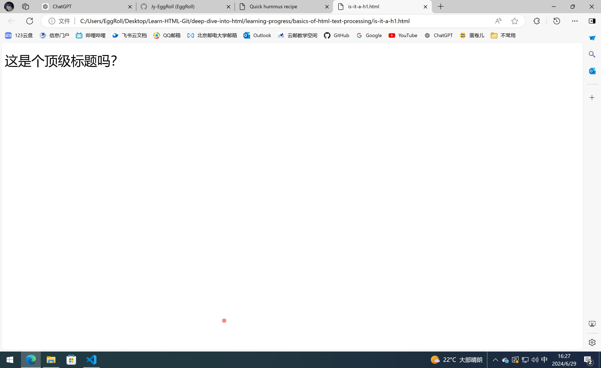

# HTML文本处理基础

## 基础：标题和段落

```HTML
<p>我是一个段落</p>
```

```HTML
<h1>我是一级标题</h1>
<h6>我是六级标题</h6>
```

下面是一些基础原则：

- 最好只对每个页面用一次`<h1>`。
- 确保在正确的层次使用正确地标题级数。
- 除非有必要，标题级数不超过3。层级太多的文件会变得笨重，难以浏览，如果可行的话，将内容分散到多个页面上。

### 为什么我们需要语义？

`<h1>`的语义值可以以多种形式被使用。比如搜索引擎、屏幕阅读器。

我们可以让任何一个元素看起来像个顶级标题。

```HTML
<span style="font-size: 32px; margin: 21px 0; display: block;">这是个顶级标题吗？</span>
```



显然，不是的，它没有顶级标题的语义值。`<span>`元素没有语义，使用CSS或者JS时，可以用它来包裹内容。

## 列表

### 无序列表

```HTML
<ul>
    <li>苹果</li>
    <li>香蕉</li>
    <li>橘子</li>
</ul>
```

### 有序列表

```HTML
<ol>
    <li>第一步</li>
    <li>第二步</li>
    <li>第三步</li>
</ol>
```

### 嵌套列表

```html
<ol>
    <li>
        这是有序列表的第一项
    </li>
    <li>
        这是有序列表的第二项
        <ul>

            <li>
                我要在这里引入一个无序列表
            </li>
        </ul>
    </li>
</ol>
```

## 重点强调

### 强调

`<em>`元素（emphasis），浏览器的默认样式是斜体。但是，这样得到的斜体字是有强调语义的。所以，如果单纯地想要获得斜体字，可以用其他方法，而不是强调语法。

### 强烈的重要性

`<strong>`元素，默认为粗体，含语义。

联合使用

```html
<p>
    这杯液体毒性很<strong>大</strong>，你喝了<em>可能</em>会死。
</p>
```

### 斜体字、粗体字、下划线

这些都是仅仅影响表象而没有语义的元素。语义对于无障碍和搜索引擎优化非常重要。所以，如果非必要，不使用没有语义的元素。

`<b>`传统意义上的粗体。比如关键字、产品名称、引导句……

`<i>`传统意义上的斜体。比如外国文字、分类名称、技术术语、一种思想……

`<u>`下划线。比如专有名词、拼写错误……

值得注意的是，人们往往会将下划线和超链接联系在一起。所以，非必要不使用下划线。