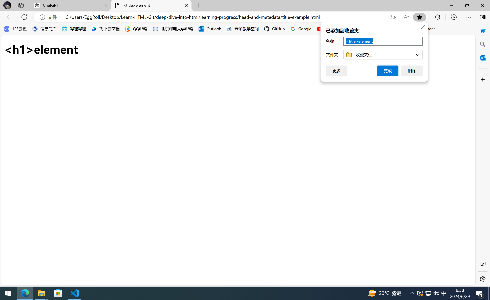
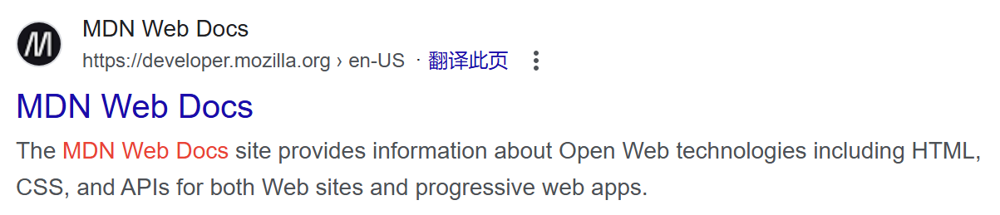

# “头”里有什么——HTML元信息

页面加载完后，头是不会显示在Web浏览器里的。Web浏览器需要根据头中的信息，正确地渲染文档。头中包含了许多元数据。

## 什么是HTML头部

`<head>`和`</head>`之间包含的就是HTML**头部**。

## 添加标题

`<title>`别和`<h1>`搞混了。`<title>`为网页添加标题，`<h1>`为`<body>`添加顶级标题。

```HTML
<!DOCTYPE html>
<html lang="en-US">

<head>
    <meta charset="utf-8">
    <meta name="viewport" content="width=device-width">
    <title>&lt;title&gt;element</title>
</head>

<body>
    <h1>&lt;h1&gt;element</h1>
</body>

</html>
```



`<title>`元素也被用作建议的书签名，在搜索结果中展示的也是这个名字。

## 元数据：meta

HTML有一个“官方”的方式来添加元数据，也就是`<meta>`元素。

### 指定文档中的字符编码

```html
<meta charset="utf-8">
```

utf-8包含了人类语言中的大部分字符，可以很好地处理多语言网页。

假如将字符集设为了`ISO-8859-1`，这是拉丁字母表字符集，显示中文、日文等就会出现乱码。

一些浏览器会自动修正错误的编码，比如Chrome，但是，没有理由不手动设置`utf-8`编码。

### 添加作者和描述

`name`和`content`属性是很有用的。

指定作者：

```HTML
<mata name="author" content="EggRoll">
```

一些内容管理系统会自动获取作者信息，用于某些用途。

提供描述：

```html
<meta name="description" content="The website is about my learning progress.">
```

关键词描述对搜索引擎优化有帮助。



上面的大字是`<title>`元素，下面这行小字就是`<meta>`中的描述。

## 在你的站点添加自定义图标

```html
<!DOCTYPE html>
<html lang="en-US">

<head>
    <link rel="icon" href="https://raw.githubusercontent.com/Jy-EggRoll/Learn-HTML-Git/main/images/logo.ico"
        type="images/x-icon">
    <meta charset="utf-8">
    <meta name="viewport" content="width=device-width">
    <title>&lt;title&gt;element</title>
</head>

<body>
    <h1>&lt;h1&gt;element</h1>
</body>

</html>
```

成功了！

## 在HTML中应用CSS和JavaScript

CSS可以使网页更加炫酷，JavaScript可以使网页拥有交互功能。他们分别使用`<link>`元素和`<script>`元素。

- `<link>`元素位于文档的头部，它有两个属性，`rel="stylesheet"`表明这是文档的样式表，而`href`包含了样式表文件的路径。

```HTML
<link rel="stylesheet" href="my-css-file.css">
```

- `<script>`元素也在文档的头部，包含`src`属性，指向需要加载的JavaScript路径。同时，在后面加上defer以告诉浏览器，在加载完所有的HTML内容后再加载JavaScript，这样可以保证JavaScript试图访问的内容都已经存在，从而不会发生错误。有很多方法可以实现类似的效果，但是这是最可靠的方法。

```HTML
<script src="my-js-file.js" defer></script>
```

## 为文档设定主语言

这个属性可以通过`<html>`中的`lang`属性来设置，这可以被搜索引擎更有效地搜索。当进行屏幕朗读时，这可能也会提供帮助。比如six在英语和法语中读音不同。

文档可以分段设置不同语言。

```HTML
<p>Chinese:<span lang="zh_CN">你好。</span></p>
```