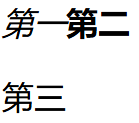
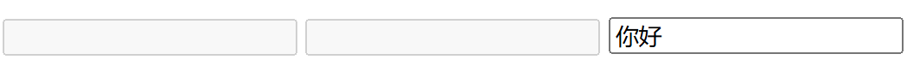
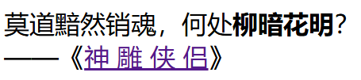
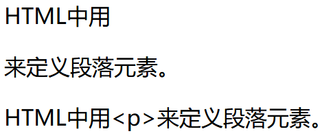

# 开始学习HTML

本笔记会涉及元素（Element）、属性（Attribute）等重要术语，HTML元素和页面的组织方式等。

## 什么是HTML

HyperText Markup Language，超文本标记语言，用来告知浏览器如何组织页面。

`这是一行示例文字`

如果我想把上面这一部分单独封装起来，作为一个独立的段落，那么我可以：

```HTML
<p>这是一行示例文字</p>
```

备注：HTML标签是不区分大小写的。`<title>` `<p>`等写为`<Title>` `<P>` `<TITLE>`都是可以的。但是从规范性的角度来说，还是全部采用小写字母为宜。

## 剖析一个HTML元素

`<p>你好</p>`

这整体就是一个段落元素，`<p>`是开始标签，`</p>`是结束标签，两部分中间的即为元素的内容

### 创建一个元素

`<em>斜体</em>`这样就创建一个斜体元素。

### 嵌套元素

`<p>小猫的脾气<strong>很</strong>暴躁</p>`要确保所有的元素都能被正确地打开和关闭。

### 块级元素和内联元素

- 块级元素在页面上会用新行的方式呈现，比如标题、段落、列表。
- 内联元素不会换行，比如粗体、斜体、超链接。

```HTML
<em>第一</em><strong>第二</strong><p>第三</p>
```



这是其显示效果。

### 空元素

不是所有的元素都拥有内容。``元素空有标签，没有内容，表示在某位置嵌入图片。

```html

```

## 属性

元素也可以拥有属性，属性包含元素的额外信息。

属性要包含：

- 一个空格，用于分隔属性和元素名称，如果有多个属性，那么每个属性都要用空格分隔。
- 属性名称，后面跟一个等于号。
- 一个属性值，由一对括号引起来。

### 为元素添加属性

举例：元素`<a>`是**锚**，锚元素可以添加多种属性。

`href`，声明超链接的地址。

`title`添加额外提示，比如悬停鼠标时提供一些信息。

`target`用于控制是否在新标签页显示。

下面是在新标签页打开百度的代码示例。

```html
<p><a href="https://www.baidu.com" title="百度" target="_blank">点击以在新标签页打开百度</a></p>
```


### 布尔属性

有时会见到没有值的属性，一般是布尔属性。布尔属性的值一般与名字相同。例如`disabled`属性，将其分配给表单元素时，可以禁用输入。

```html
<input type="text" disabled="disabled">

<!-- 和上面等价的写法 -->
<input type="text" disabled>

<!-- 这个文本框是可以输入的 -->
<input type="text">
```



被禁用的元素通常有一个灰色的外观。

### 省略包围属性值的引号

在有些情况下，这是被允许的。但是，建议始终添加引号，这样可以避免很多问题，并且使代码更规范。

### 使用单引号还是双引号？

都可以。

不同引号也可以嵌套使用。

以后若要将引号显示在文本中，可能需要学习HTML实体引用。

## 剖析HTML文档

单独的HTML元素作用不大，不同的HTML元素可以组合成HTML界面。

```html
<!DOCTYPE html>

<html lang="zh-CN">

<head>
    <meta charset="utf-8">
    <title>我的测试站点</title>
</head>

<body>
    <p>这是我的页面</p>
</body>

</html>
```

1. `<!DOCTYPE html>`：声明文档类型。文档类型是一个历史遗留问题。需要包含它才能使其他东西正常工作。现在只需要知道`<!DOCTYPE html>`是最短的有效文档声明。
2. `<html>`元素，根元素。
3. `<head>`元素，容器元素。这之中的内容不会在界面上显示。
4. `<meta>`元素，代表了不能由HTML元素代表的一些元数据。`charset`属性将文档的字符集设为了utf-8，可以避免以后出现的文本问题。
5. `<title>`元素，页面标题（书签默认显示的内容也是这个）。
6. `<body>`元素，显示的内容。

### 为HTML文档添加一些特征

构建一个神雕侠侣网站

```html
<!DOCTYPE html>

<html lang="zh-CN">

<head>
    <meta charset="utf-8">
    <title>神雕侠侣</title>
</head>

<body>
    <h1>经典回忆</h1>
    <p>
        莫道黯然销魂，何处<strong>柳暗花明</strong>？<br>——《<a href="https://www.baidu.com" title="请搜索神雕侠侣" target="_blank">神雕侠侣</a>》
    </p>
    
</body>

</html>
```

效果如图


直接采用了在线加载的图片。

### HTML中的空白

```html
    <p>
        莫道黯然销魂，何处<strong>柳暗花明</strong>？<br>——《<a href="https://www.baidu.com" title="请搜索神雕侠侣" target="_blank">神   雕   侠   
            
            
            侣</a>》
    </p>
```



无论在HTML元素的内容中使用多少空格、换行，当渲染这些代码时，HTML解释器都会将连续出现的空白字符减少为一个单独的空格符。

## 实体引用：在HTML中包含特殊字符

在HTML中，`<` `>` `"` `'` `&`是特殊字符。它们是HTML语法的一部分，那么如何将这些字符包含在文本中呢？

|原义字符|等价字符|
|:-:|:-:|
|<|`&lt;`|
|>|`&gt;`|
|"|`&quot;`|
|'|`&apos;`|
|&|`&amp;`|

```HTML
<p>HTML中用<p>来定义段落元素。</p>

<p>HTML中用&lt;p&gt;来定义段落元素。</p>
```



## HTML注释

```HTML
<!-- 这个就是HTML注释 -->
```