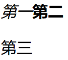

# 开始学习HTML

本笔记会涉及元素（Element）、属性（Attribute）等重要术语，HTML元素和页面的组织方式等。

## 什么是HTML

HyperText Markup Language，超文本标记语言，用来告知浏览器如何组织页面。

`这是一行示例文字`

如果我想把上面这一部分单独封装起来，作为一个独立的段落，那么我可以：

```HTML
<p>这是一行示例文字</p>
```

备注：HTML标签是不区分大小写的。`<title>` `<p>`等写为`<Title>` `<P>` `<TITLE>`都是可以的。但是从规范性的角度来说，还是全部采用小写字母为宜。

## 剖析一个HTML元素

`<p>你好</p>`

这整体就是一个段落元素，`<p>`是开始标签，`</p>`是结束标签，两部分中间的即为元素的内容

### 创建一个元素

`<em>斜体</em>`这样就创建一个斜体元素。

### 嵌套元素

`<p>小猫的脾气<strong>很</strong>暴躁</p>`要确保所有的元素都能被正确地打开和关闭。

### 块级元素和内联元素

- 块级元素在页面上会用新行的方式呈现，比如标题、段落、列表。
- 内联元素不会换行，比如粗体、斜体、超链接。

```HTML
<em>第一</em><strong>第二</strong><p>第三</p>
```



这是其显示效果。

### 空元素

不是所有的元素都拥有内容。``元素空有标签，没有内容，表示在某位置嵌入图片。

```html

```

